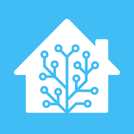

# minimalist-lovelace
Minimalist Lovelace Home Assistant Dashboard

<!-- PROJECT LOGO -->
 

  

  <h3 align="center">Minimalist Dashboard</h3>

  

    Lovelace Home Assistant
     
  

<!-- ABOUT THE PROJECT -->
## About The Project

[![Product Name Screen Shot][product-screenshot]](https://github.com/thiagobucca/minimalist-lovelace)

Simple and Minimalistic Dashboard for Home Assistant Lovelace. This is running on my Raspberry Pi 8GB at Home as a Docker Container for
the past year, rock solid. I made some changes mostly in stock custom room card to fit my needs. Feel free to get in touch and let me know
what you think!

### Built With

* [HomeAssistant](https://www.home-assistant.io/)
* [Custom Button Card](https://github.com/custom-cards/button-card)
* [UI-Lovelace-Minimalist](https://github.com/UI-Lovelace-Minimalist/UI)

<!-- LICENSE -->
## License

Distributed under the MIT License. See `LICENSE` for more information.

<!-- MARKDOWN LINKS & IMAGES -->
[product-screenshot]: images/screenshots.png